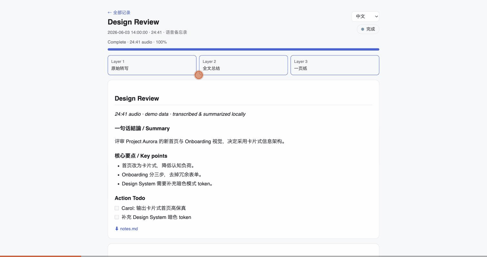

# voice-notes

**English** · [中文](README.zh.md) · [日本語](README.ja.md)




> Home → a meeting's 3-layer summary → the cross-meeting knowledge graph.
> _(Placeholder demo data. [▶ full-quality MP4](docs/demo.mp4).)_

Standalone local audio notes extracted from
[`type-by-voice`](https://github.com/kotaro-nakata/type-by-voice).

This tool records or imports audio, transcribes it locally with
`faster-whisper`, and writes:

- `transcript.md`
- `notes.md`
- `summary.md`
- `audio.wav`
- `meta.json`

It does not do global push-to-talk dictation, tray UI, or paste text into the
focused app. Those remain the responsibility of
[`type-by-voice`](https://github.com/kotaro-nakata/type-by-voice).

## Setup

**One-command install.** It creates a Python venv, downloads the local Whisper
transcription model, installs [Ollama](https://ollama.com) + a small local
summary model, and writes a config — so transcription **and** summaries run
fully locally, no cloud, out of the box.

macOS / Linux:

```bash
git clone https://github.com/nikoloside/voice-notes
cd voice-notes
./install.sh
```

Windows (PowerShell):

```powershell
git clone https://github.com/nikoloside/voice-notes
cd voice-notes
powershell -ExecutionPolicy Bypass -File install.ps1
```

Then start the web UI:

```bash
./record-notes          # macOS / Linux
.\record-notes.ps1      # Windows
```

Lighter machines can use a smaller model:
`VOICE_NOTES_WHISPER_MODEL=small ./install.sh` (and `VOICE_NOTES_LLM=llama3.2:3b`).

<details><summary>Manual setup (Python 3.11+)</summary>

```bash
cd voice-notes
python3 -m venv .venv
.venv/bin/pip install -r requirements.txt
./record-notes
```

Layer 2/3 summaries need an LLM — run Ollama locally, or point `openai_url` at
an OpenAI-compatible server (see below).
</details>

The default page is <http://127.0.0.1:8765>. It can start/stop a recording,
upload audio files, import macOS Voice Memos, and download the generated files.
The generated notes are plain Markdown in a local folder — keep them in your own
repo, share them, or read them from Claude via the [MCP server](#mcp-server-read-notes-from-claude).

The three layers run strictly in sequence — Layer 1 → Layer 2 → Layer 3:

- Layer 1: raw chunked transcript, written live as each audio segment
  finishes. Nothing else runs until the whole transcript is done.
- Layer 2: once Layer 1 completes, the ENTIRE transcript is handed to the
  local Ollama model in one go, producing a detailed full-text summary
  grouped by topic (decisions, numbers, names, todos, open questions).
  Transcripts too long for the model context are internally split into a
  few large blocks and merged — this is invisible in the output.
- Layer 3: the Layer 2 full summary is condensed again into a one-page
  note: 一句话结论 / 核心要点 / Action Todo / Checkpoints.

`summary.md` = the Layer 3 one-pager, followed by the Layer 2 full summary.
`notes.md` shows all three layers.

Layer 2/3 need an LLM. Backend resolution (`[summary] backend = "auto"`):

1. An OpenAI-compatible server if `openai_url` is set and reachable — e.g.
   LM Studio on a bigger machine over Tailscale
   (`openai_url = "http://100.x.x.x:1234/v1"`; empty `openai_model` uses the
   first model the server reports).
2. Otherwise local Ollama (`ollama_url`, `ollama_model`).
3. Otherwise the rule-based extractive fallback (much worse).

For uploaded/imported audio, the list and session page show conversion progress:
transcribed time, total audio time, and percent complete. For live recording,
progress compares the already transcribed portion with the currently recorded
duration.

Uploaded/imported audio is checkpointed per chunk in `chunks.json`. If a
conversion is interrupted, open the session and click **Resume conversion**; the
completed chunks are reused and only the missing chunks are transcribed. This
keeps the pipeline chunk-oriented:

```text
chunk N audio -> raw transcript -> core notes -> value/todo/checkpoints -> checkpoint
chunk N+1 audio -> raw transcript -> core notes -> value/todo/checkpoints -> checkpoint
...
final transcript -> final summary.md
```

Final `summary.md` is generated after all transcript chunks are complete.

## Commands

```bash
./record-notes                    # start localhost UI
./record-notes --record           # record from the terminal; Enter stops
./record-notes --import file.m4a   # import one audio file and wait
./record-notes --import file.m4a --language zh
./record-notes --list-devices      # list microphone devices
```

Useful overrides:

```bash
./record-notes --port 8770 --no-browser
./record-notes --data-dir ~/.local/share/voice-notes/sessions
```

## Knowledge graph

Each finished session gets a knowledge-graph extraction pass: the same LLM
pulls out entities (person / project / org / concept / decision / todo) and
their relations from the notes, cached in the session's `entities.json`.

`/api/graph` aggregates every session's `entities.json` into one graph — each
entity is merged across sessions by name, so a project or person that recurs
becomes a hub linking all the meetings that mention it. The graph is served in
a generic `{nodes, edges}` contract, rendered by the bundled `graph.html`
viewer (which can be reused for any data source that speaks the same contract).

Open **🕸️ 知识图谱** on the home page (or `/graph`) for an interactive
force-directed view: click a node for details, double-click a session node to
open it, search to focus.

Backfill entities for existing sessions (they were made before this pass):

```bash
.venv/bin/python -c "import voice_notes as v, tomllib; \
c=tomllib.load(open('$HOME/.config/voice-notes/config.toml','rb'))['summary']; \
s=v.Summarizer(**{k:c[k] for k in ('backend','ollama_model','ollama_url','openai_url','openai_model','openai_api_key')}); \
import pathlib; [v.build_entities(p,s,force=True) for p in sorted((pathlib.Path.home()/'.local/share/voice-notes/sessions').glob('2026*'))]"
```

## MCP server (read notes from Claude)

`voice-notes-mcp` is a read-only [MCP](https://modelcontextprotocol.io) server
(stdio) that exposes the notes voice-notes has already generated to any MCP
client — Claude Code, Claude Desktop, etc. Nothing needs to be running; it
reads the session folders on disk. Tools:

- `list_notes(limit=50)` — newest sessions with id, title, date, duration, status
- `read_note(session_id, part="summary")` — `part` is `summary` (one-page +
  full), `one_page`, `full`, `notes` (all three layers), or `transcript`
- `search_notes(query, limit=20)` — keyword search across summaries/notes
- `knowledge_graph(top=20)` — cross-meeting graph overview: counts, entity
  types, and the most-mentioned entities with the meetings they appear in
- `find_entity(name)` — look up a person/project/concept: description, which
  meetings mention it, and related entities

Add it to **Claude Code**:

```bash
claude mcp add voice-notes --scope user -- /ABS/PATH/voice-notes/voice-notes-mcp
```

Add it to **Claude Desktop** (`~/Library/Application Support/Claude/claude_desktop_config.json`):

```json
{
  "mcpServers": {
    "voice-notes": {
      "command": "/ABS/PATH/voice-notes/voice-notes-mcp"
    }
  }
}
```

It reads the same data dir as the app; override with `--data-dir DIR` or the
`VOICE_NOTES_DATA_DIR` env var. Then ask Claude things like “list my voice
notes”, “read the one-page summary of yesterday’s meeting”, or “search my
notes for a keyword”.

## Configuration

The first run creates:

```text
~/.config/voice-notes/config.toml
```

Default session data is stored in:

```text
~/.local/share/voice-notes/sessions/<session-id>/
```

Each session folder contains `meta.json`, `transcript.md`, `summary.md`,
`notes.md`, `chunks.json` for imported audio, and usually `audio.wav`.

The default transcription language is Chinese (`zh`). Use the language selector
on the web page or `--language auto` for intentionally mixed-language audio.
Auto is chunk-level: each audio chunk detects its own language. If confidence is
low, it falls back to the previous chunk language to avoid short Chinese chunks
being misread as English.

## Accuracy Notes

This project runs local Whisper, so transcription quality is mostly affected by
the model, audio quality, chunk length, and whether the model gets enough
context. It is not using a cloud input method like Doubao, so cloud-side Chinese
ASR/post-processing can still be better.

Defaults now favor Chinese note-taking accuracy:

- Chinese is forced by default instead of auto language detection.
- Audio imports use longer chunks, so Chinese口语 has more context.
- Each chunk receives recent previous transcript as context.
- `beam_size` defaults to `8`.

If you want higher accuracy and can accept slower speed, edit
`~/.config/voice-notes/config.toml`:

```toml
[model]
name = "large-v3"
language = "zh"
# Or use chunk-level detection:
# language = "auto"
# auto_language_threshold = 0.45

[transcription]
chunk_seconds = 45.0
beam_size = 8
condition_on_previous_text = true
```

If you want faster previews, use `large-v3-turbo` and lower
`chunk_seconds`, at the cost of more recognition errors.

## Local summary

Summaries are local:

- If Ollama is running, `voice-notes` uses the configured local model.
- Otherwise it falls back to a built-in extractive summary.

No cloud API is used by this project.

## System audio

Linux speaker capture uses `pactl` and `parec` to read the default sink monitor.
On macOS, speaker capture requires a loopback device such as BlackHole and a
Multi-Output Device. If system capture is unavailable, recordings continue as
mic-only.

For imported files, install `ffmpeg` when possible. macOS can also fall back to
`afconvert`.
